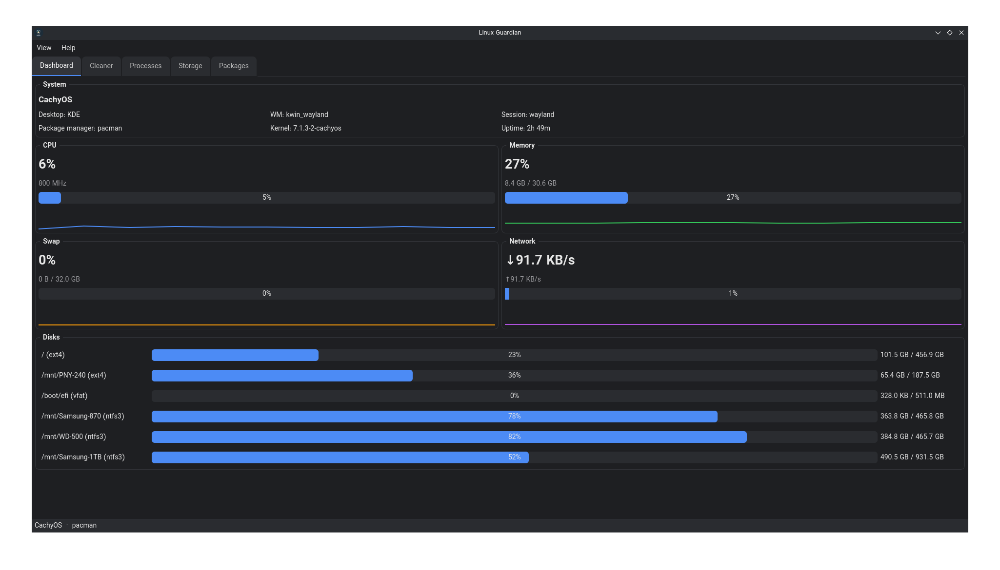

# 🛡️ Linux Guardian

<div align="center">
  
  <br><br>
  <strong>A cross-distribution Linux system optimization and maintenance tool</strong>
  <br>
  Built with Python 3.13+ and PyQt6
  <br><br>
  
</div>

---

## 📋 Overview

Linux Guardian automatically detects your distribution, package manager, and desktop environment, providing a unified interface for system maintenance. It features a live dashboard, safety-first cache/leftover cleaner, process manager, storage analyzer, and package cache/orphan management — all running off the UI thread, with nothing deleted without your explicit confirmation.

---

## ✅ What's Implemented

| Area | Description |
|------|-------------|
| **Distro Detection** (`app/core/distro.py`) | Parses `/etc/os-release`, detects package manager, AUR helper, DE, WM, session type, init system |
| **Dashboard** (`app/ui/dashboard_tab.py`) | Live CPU (total + freq), RAM, swap, ZRAM detection, per-disk usage, network throughput — background polling, never blocks UI |
| **Deep Scanner** (`app/scanner/`) | Known cache/temp/log locations across all target distros' package managers, dev-tool caches (npm/pip/cargo/go), old/large file scan, broken symlinks, empty dirs |
| **Leftover Detection** (`app/scanner/leftover_scanner.py`) | Flags `~/.config`, `~/.cache`, `~/.local/share`, `~/.var/app` directories that don't match any installed binary/desktop entry/Flatpak app |
| **Cleaner Engine** (`app/cleaner/cleaner_engine.py`) | Risk-leveled (Safe/Probably Safe/Needs Confirmation/Dangerous), soft-delete to timestamped quarantine, full Undo, audit log |
| **Packages** (`app/packages/package_manager.py`) | Adapters for pacman, apt, dnf, zypper, xbps, apk, flatpak — cache size, orphan detection, confirm-before-run command plans |
| **Process Manager** (`app/ui/process_tab.py`) | Live tree view, CPU/mem/status/nice, kill/terminate/suspend/resume, search filter |
| **Storage Analyzer** (`app/ui/storage_tab.py`) | Largest files/folders under any chosen directory |
| **Theming** (`app/ui/theme.py`) | Light / Dark / Auto (follows system palette), accent color support |

---

## 🏗️ Architecture

```
app/
  core/       Distro & system detection, logging
  scanner/    Read-only filesystem scanners (never delete anything)
  cleaner/    Risk model + the ONLY module allowed to delete/quarantine files
  packages/   Package manager adapters (pacman/apt/dnf/zypper/xbps/apk/flatpak)
  workers/    QThreadPool-based worker wrappers — every long-running call goes through here
  ui/         PyQt6 tabs + theming
  utils/      Formatting helpers
  icon/       Application icon
tests/        Unit tests (cleaner safety behavior, distro parsing)
```

### Key Design Decisions

- **Scan and delete are separate modules.** `app/scanner/` only reads and reports `Finding` objects; `app/cleaner/cleaner_engine.py` is the only code path that touches the filesystem destructively. Even then, it moves files to `~/.local/share/linux-guardian/quarantine/<timestamp>/` rather than deleting them, so every clean action is reversible via Undo until the user explicitly empties quarantine.

- **Nothing above `RiskLevel.SAFE` is pre-selected.** `cleaner_engine.default_selection()` is the single place this policy lives — the UI must not hand-roll its own "select all" behavior.

- **Every long operation runs off the UI thread** via `app/workers/worker_thread.py`'s `FunctionWorker` / `PollingWorker`, which auto-detects `should_stop`/`progress_cb` parameters so scanners get cancellation and live progress for free.

- **Package-manager-mutating actions are never auto-run.** `package_manager.py` adapters return a `CommandPlan` (description + command list) that the UI must show to the user and get explicit confirmation for before executing via `pkexec`.

---

## 🚀 Setup

```bash
# Clone the repository
git clone https://github.com/hoomaanf/linux_guardian.git
cd linux_guardian

# Create and activate virtual environment
python3 -m venv venv
source venv/bin/activate

# Install dependencies
pip install -r requirements.txt

# Run the application
python3 main.py
```

---

## 🧪 Running Tests

```bash
pip install pytest
pytest tests/ -v
```

---

## 📦 Packaging (PyInstaller)

```bash
pip install pyinstaller
pyinstaller --name linux-guardian --onefile --windowed main.py
```

> **Note:** PyQt6 apps built with PyInstaller often need `--hidden-import` flags for platform plugins on some distros. If the built binary fails to find a Qt platform plugin, add `--collect-all PyQt6`.

---

## 🔒 Safety Model

- ✅ Nothing is ever deleted without an explicit, user-checked selection.
- ✅ Deletion is always a move into a timestamped quarantine directory, **never a hard delete**.
- ✅ Every scan/clean/package action is written to `~/.local/share/linux-guardian/logs/linux-guardian.log`.
- ✅ Package-manager and orphan-removal actions always show the exact shell command before running it.
- ✅ `cleaner_engine.empty_quarantine()` — the one true permanent-delete function in the codebase — is only ever called from an explicit **"Empty Quarantine"** user action, never automatically.

---

## 📸 Screenshots

<div align="center">
  
  <br>
  <em>Main Dashboard</em>
</div>

---

<div align="center">
  <sub>Built with ❤️ for the Linux community</sub>
</div>
